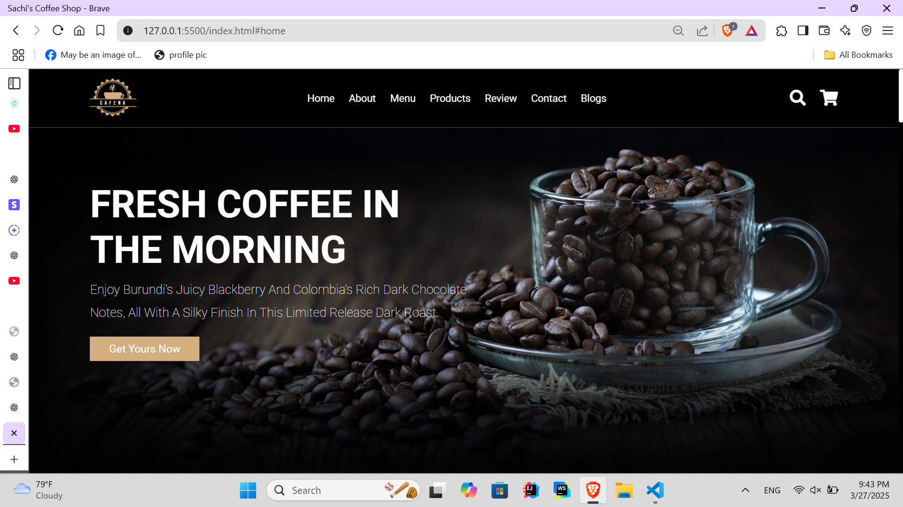
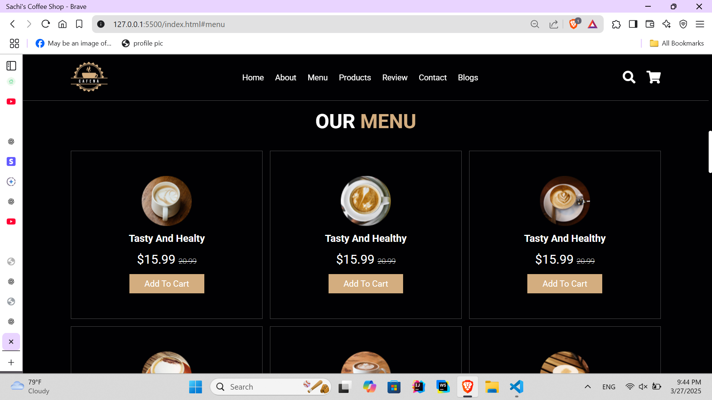
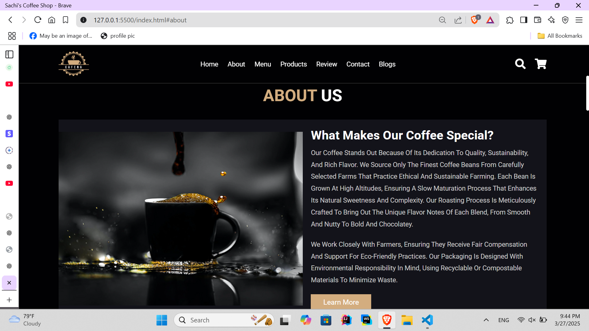
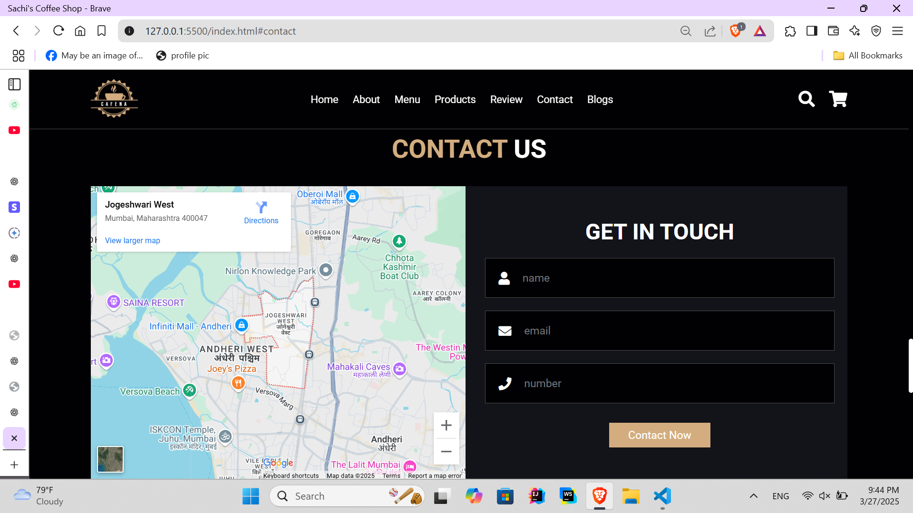
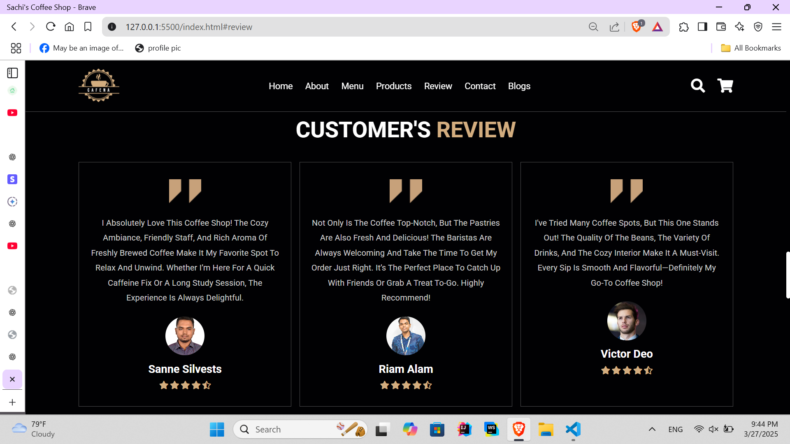
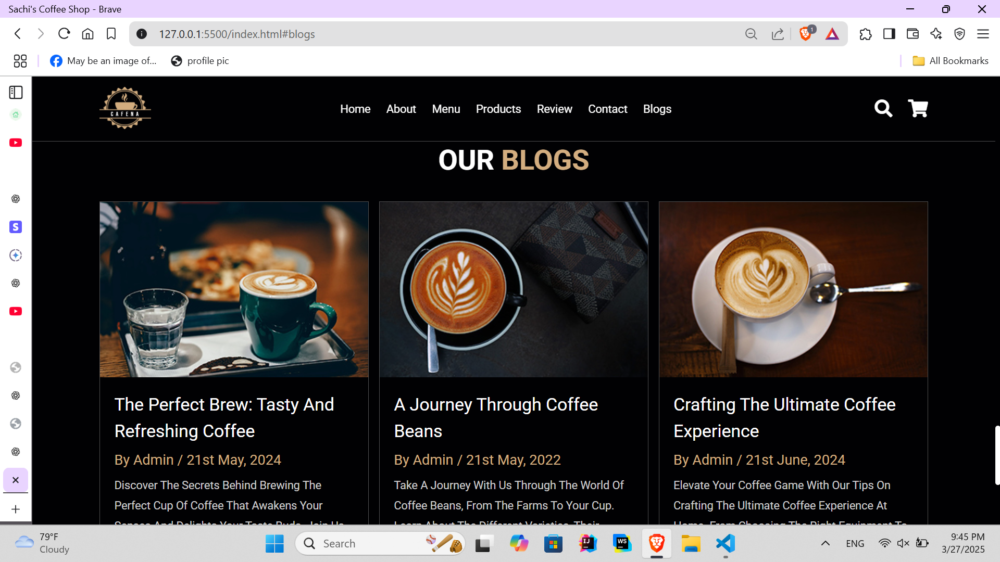

# Coffee Shop Website

This is a simple and responsive Coffee Shop website built using HTML, CSS, and JavaScript.

## Features
- **Home Page**: Introduction to the coffee shop with an appealing hero section.
- **Menu Page**: Displays available coffee and beverage options.
- **About Page**: Details about the coffee shop's history and values.
- **Contact Page**: Allows users to get in touch via a contact form.
- **Responsive Design**: Works on mobile, tablet, and desktop devices.
- **Interactive UI**: JavaScript enhances the user experience with animations and interactions.

## Technologies Used
- HTML5
- CSS3 (Flexbox, Grid, Media Queries)
- JavaScript (Vanilla JS for interactivity)

## Installation & Usage
1. Clone the repository:
   ```bash
   git clone https://github.com/sachiniwathudura/Cofee-Shop-Wesite.git
   ```
2. Navigate to the project folder:
   ```bash
   cd coffee-shop-website
   ```
3. Open `index.html` in your browser.


## Screenshots
Here are some previews of the Coffee Shop website:

### Home Page


### Menu Page


### About Page


### Contact Page


### Review Page


### Blog Page



## How to Contribute
1. Fork the repository.
2. Create a new branch:
   ```bash
   git checkout -b feature-branch
   ```
3. Make your changes and commit:
   ```bash
   git commit -m "Added new feature"
   ```
4. Push to the branch:
   ```bash
   git push origin feature-branch
   ```
5. Open a Pull Request.

## License
This project is open-source and available under the MIT License.
